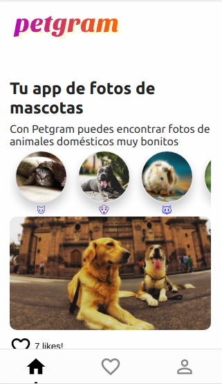

# Petgram 🐶

La App de Mascotas Implementa con React Hooks y muchas herramientas más.

[Ver la aplicación](https://petgram-apis-react.now.sh/)

## Herramientas usadas

-   Webpack

-   Babel

-   Linter

-   Now

-   Styled Components

-   Custom Hooks

-   Intersection Observer

-   GraphQL - React Apollo

-   Reach Router

-   React Helmet

-   React Memo

-   Rect Lazy

-   PropTypes

-   Workbox

-   Cypress

## ¿Cómo funciona?

Requiere Node.JS 10

-   `npm install` para instalar las dependencias.

-   `npm run dev` para el entorno de desarrollo.

-   `npm run serve:dev` para el entorno de producción.

-   `npm run test` para ejecutar pruebas.

###### [Backend usado fué tomado del curso de Platzi](https://platzi.com/cursos/react-avanzado/)

## Licencia

MIT
